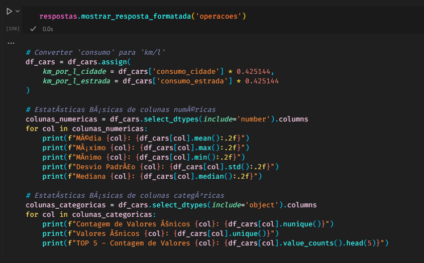

# **Introdução à Análise de Dados**

Este repositório contém um **notebook interativo** projetado para **introduzir iniciantes** ao mundo da **Análise de Dados** utilizando **Python**. O material cobre desde conceitos fundamentais até técnicas mais avançadas de exploração e visualização de dados, com foco prático utilizando a biblioteca **pandas**.

## **Objetivo:**
Esse projeto foi criado durante a semana de Iniciação ao Python, da Escola de Métodos e Pesquisa 2025 organizada pelo **Programa de Pós-Graduação em Administração** da **Universidade Federal da Paraíba**, iniciativa do Núcleo de Análise de Dados e Desempenho (Α²Δ) em colaboração com o Laboratório de Estudos e Análise de Dados em Administração (LEAD) e o Laboratório de Estudos em Modelagem Aplicada (LEMA), que ocorreram entre os dias 17 e 21 de Fevereiro de 2025.

## **Realização:**
[](https://lema.ufpb.br/)

**PPGA - UFPB** \
[**LEMA**](https://lema.ufpb.br/) \
Projects: [SAEGO](https://lema.ufpb.br/saego/), [Preço da Hora](https://precodahora.tcepb.tc.br/)
<br/>

## **Ministrantes**

<table>
  <tr>
    <td align="center">
      <a href="https://github.com/gabrielbpontes">
        
        <br />
        <sub><b>Gabriel Pontes</b></sub>
      </a>
      <br/>
      <a href="https://github.com/gabrielbpontes" target="_blank">
        
      </a>
      <br/>
      <a href="https://www.linkedin.com/in/gabriel-pontes-2152a9276/" target="_blank">
        
      </a>
    </td>
    <td align="center">
      <a href="https://github.com/NercinoN21">
        
        <br />
        <sub><b>Nercino Neto</b></sub>
      </a>
      <br />
      <a href="https://github.com/NercinoN21" target="_blank">
        
      </a>
      <br/>
      <a href="https://www.linkedin.com/in/nercino-neto/" target="_blank">
        
      </a>
    </td>
    <td align="center">
      <a href="https://github.com/pedrohmvv">
        
        <br />
        <sub><b>Pedro Henrique</b></sub>
      </a>
      <br />
      <a href="https://github.com/pedrohmvv" target="_blank">
        
      </a>
      <br/>
      <a href="https://www.linkedin.com/in/pedrohmv/" target="_blank">
        
      </a>
    </td>
  </tr>
</table>
<br>

## **📊 Conteúdo**
- Introdução ao **Pandas** e manipulação de dados
- **Leitura e exploração** de datasets reais
- **Limpeza e tratamento** de dados
- **Filtragem e seleção** de informações
- **Análise estatística** descritiva
- **Visualização de dados** com **Matplotlib e Seaborn**
- **Exercícios práticos**
- Introdução à **Regressão Linear**

Na parte de **Exercícios Práticos**, você encontrará códigos para mostrar exemplos de respostas em cada questão.

Elas foram armazenadas em um arquivo `.json`, e são gerenciadas pela classe `Respostas()`.

Exemplo:



## **🛠️ Como usar**

### 1. Clone o repositório
```bash
git clone https://github.com/seu-usuario/seu-repositorio.git
cd seu-repositorio
```

### 2. Ambiente virtual e dependências

A primeira célula de código do notebook consiste em um script para criar um ambiente virtual
e instalar as dependências:

```py
import os
import subprocess
import sys

# Diretório do projeto
path = os.getcwd()

# Nome do ambiente virtual
venv_dir = os.path.join(path, "venv")

# Criação do ambiente virtual
subprocess.run([sys.executable, "-m", "venv", venv_dir])

# Ativação do ambiente virtual conforme o sistema operacional
if os.name == "nt":  # Windows
    activate_script = os.path.join(venv_dir, "Scripts", "activate")
else:  # Linux/Mac
    activate_script = os.path.join(venv_dir, "bin", "activate")

# Determina qual comando pip usar dentro do ambiente virtual
pip_cmd = os.path.join(venv_dir, "Scripts" if os.name == "nt" else "bin", "pip")

# Instala os pacotes do requirements.txt
cmd = f"{pip_cmd} install -r requirements.txt"
subprocess.run(cmd, shell=True)

print("Ambiente virtual criado e pacotes instalados com sucesso!")
```

### 3. Execute o Jupyter Notebook

Para ver todas as saídas, execute:
```bash
jupyter notebook intro.ipynb
```

Mas, a parte de exercícios não contém códigos, mas prints de respostas.
Se executar, as respostas aparecerão.

## 📚 Estrutura do Repositório
```
.
│   intro.ipynb  # Notebook principal
│   LICENSE      # Licença do projeto
│   requirements.txt  # Dependências do projeto
│
├───data  # Datasets utilizados
│       cars-modelagem.csv
│       cars_translated.csv
│       data.csv
│
└───respostas_exemplo  # Arquivos de resposta para exercícios
    │   respostas.json
    │   respostas.py
```

